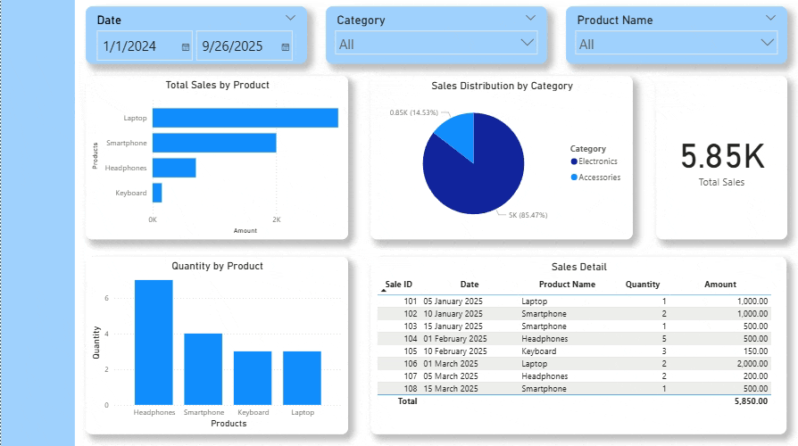
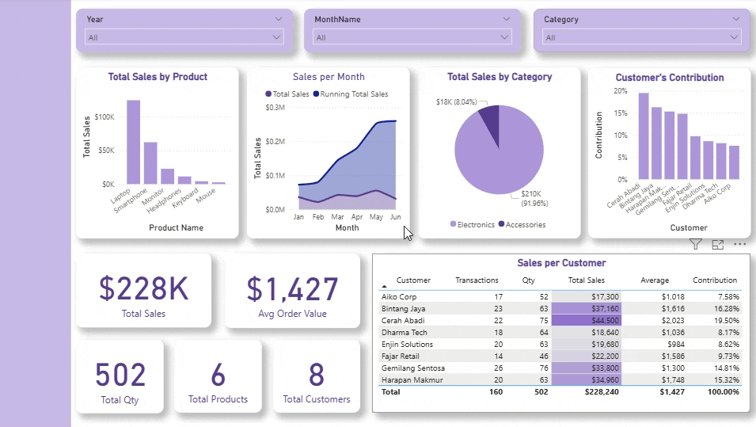

# 📊 Power BI Learning Portfolio

Repositori ini mendokumentasikan perjalanan belajar **Power BI** mingguan saya.  
Setiap folder berisi dataset, worksheet, dashboard, dan README khusus minggu tersebut.  

Tujuan utama: membangun portofolio pembelajaran Power BI step-by-step dari dasar **ETL, DAX, relasi** hingga **dashboard interaktif** dan **time intelligence**.

---

## 📅 Progress Mingguan
- [Week 1 – Power BI Basics (ETL + Dashboard)](./Week1_Basics) ✅ → ETL, relasi, DAX dasar, dashboard interaktif 
- [Week 2 – DAX Fundamentals](./Week2_Relation_DAX) ✅ → Relasi tabel dan DAX dasar
- Week 3 – Time Intelligence (akan datang)  
- Week 4 – Visualization Advanced (akan datang)  
- Week 5 – Project Mini Dashboard (akan datang)  

---

## 🎯 Target Belajar
- Menguasai Power Query (ETL, transformasi data).  
- Membuat relasi antar tabel (star schema).  
- Membuat DAX measure dasar hingga advanced (time intelligence).  
- Mendesain dashboard interaktif yang profesional.  
- Menyusun portofolio nyata sebagai bukti keterampilan Power BI.  

---

## 📸 Dashboard Preview

---

## 📌 Tools
- **Power BI Desktop** (Visualisasi & DAX)  
- **Excel** (Dataset & Worksheet)  
- **GitHub** (Version Control & Portfolio Hosting)  

---

✨ Stay tuned untuk update tiap minggu!  
