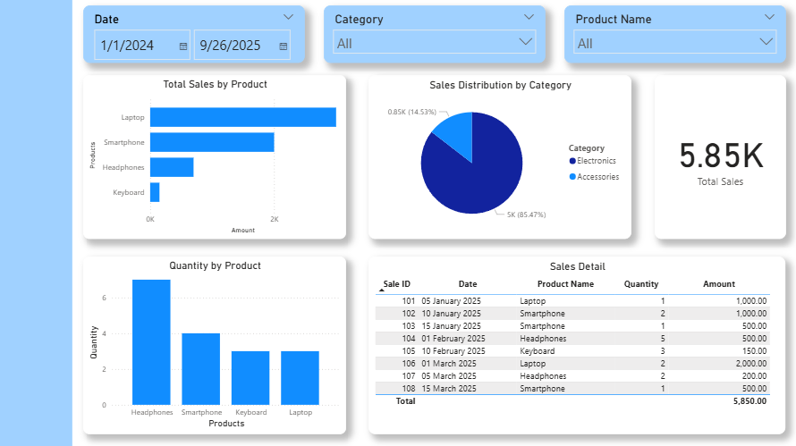

# 📊 Portfolio Week 1 – Power BI Basics

## 📌 Materi Minggu Ini
- Dasar Power Query (ETL, transformasi data)
- Merge Queries
- Relasi Many-to-One (Sales ↔ Products)
- DAX Measure Dasar (`SUM`, `DISTINCTCOUNT`)
- Visualisasi & Dashboard interaktif

## 📂 File
- `PowerBI_Dataset.xlsx` – dataset latihan (Products & Sales)
- `PowerBI_Worksheet.xlsx` – instruksi step-by-step ETL & DAX
- `dashboard_week1.png` – hasil dashboard visualisasi

## 📸 Dashboard Preview

## 📝 Penjelasan Dashboard
1. **Slicer (Date, Category, Product Name)** → untuk filter dinamis.  
2. **Total Sales by Product (Bar Chart)** → perbandingan nilai penjualan antar produk.  
3. **Quantity by Product (Column Chart)** → total unit terjual per produk.  
4. **Sales Distribution by Category (Pie Chart)** → kontribusi kategori Electronics vs Accessories.  
5. **Card (Total Sales)** → headline metrik utama 5.85K.  
6. **Sales Detail Table** → daftar transaksi detail + subtotal.  

## ✅ Progress Minggu 1
- Paham ETL dasar (cleaning, remove duplicates, merge query).  
- Bisa membuat relasi many-to-one.  
- Berhasil membuat DAX measure sederhana.  
- Membangun dashboard interaktif dengan slicer & visual dasar.  

---

📅 **Next Week (Week 2):** DAX Lanjutan – Time Intelligence (TOTALYTD, SAMEPERIODLASTYEAR, Growth %).
