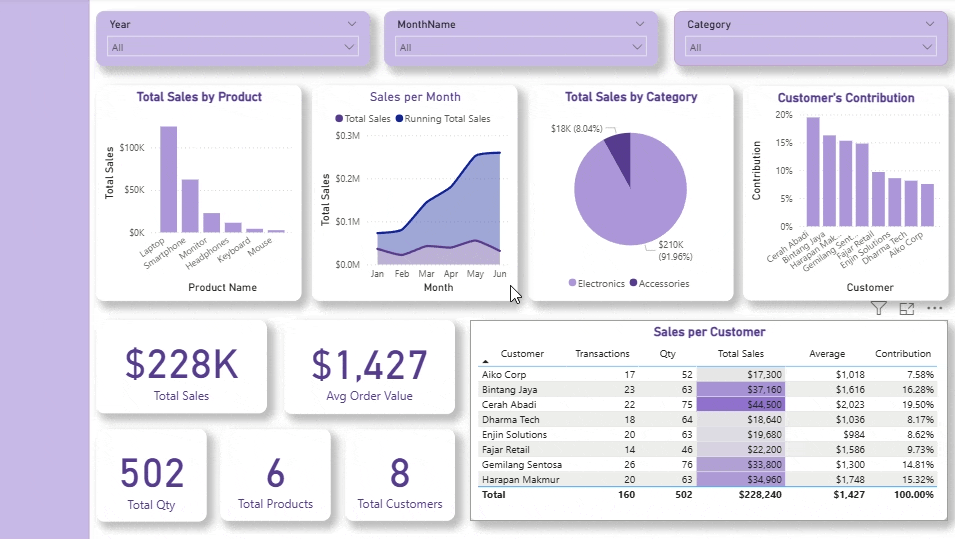

@ -0,0 +1,34 @@
# 📊 Portfolio Week 2 – Relationships & Basic DAX

## 📌 Materi Minggu Ini
- DAX Measure (`SUM`, `DISTINCTCOUNT`)
- Derived Metric (`DIVIDE`)
- Visualisasi & Dashboard interaktif

## 📂 File
- `PowerBI_Week2_Dataset.xlsx` – dataset latihan (Customers, Dates, Products & Sales)
- `PowerBI_Week2_Worksheet.xlsx` – instruksi step-by-step Relationships & Basic DAX
- `dashboard_week2.png` – hasil dashboard visualisasi

## 📸 Dashboard Preview


## 📝 Penjelasan Dashboard
1. **Slicer (Year, Month, Category)** → untuk filter dinamis.  
2. **Total Sales by Product (Bar Chart)** → perbandingan nilai penjualan antar produk.  
3. **Sales per Month (Area Chart)** → tren naik turun penjualan disertai running total sales.  
4. **Sales Distribution by Category (Pie Chart)** → kontribusi kategori Electronics vs Accessories. 
5. **Customer's Contribution (Bar Chart)** → perbandingan kontribusi penjualan antar pelanggan.  
6. **KPI Cards** → headline metrik utama.  
7. **Sales per Customer Table** → data total penjualan dan rata-rata transaksi per customer. 

## ✅ Progress Minggu 2
- Paham ETL dasar (cleaning, remove duplicates, merge query).  
- Bisa membuat relasi many-to-one.  
- Berhasil membuat DAX measure.  
- Membangun dashboard interaktif dengan slicer & visual dasar.
- Menambahkan formatting ke visual.  

---

## ✅ DAX Measures
```DAX
Total Sales = SUM(Sales[Amount])
Total Qty = SUM(Sales[Quantity])
Total Customers = DISTINCTCOUNT(Sales[CustomerID])
Total Transactions = DISTINCTCOUNT(Sales[SaleID])
Total Product = DISTINCTCOUNT(Sales[ProductID])

Avg Order Value = DIVIDE([Total Sales], [Total Transactions])
Avg Sales per Cust = DIVIDE([Total Sales], [Distinct Customers])
Avg Sales per Unit = DIVIDE([Total Sales], [Total Qty])

Customer Rank = 
RANKX( ALL(Customers[CustomerName]), [Total Sales], , DESC )

% of Total Sales = 
DIVIDE( [Total Sales],
        CALCULATE([Total Sales], ALL(Customers)) )


Running Total Sales =
CALCULATE([Total Sales], FILTER(ALL(Dates), Dates[Date] <= MAX(Dates[Date])))
```

---

📅 **Next Week (Week 3):** DAX Lanjutan – Time Intelligence (TOTALYTD, SAMEPERIODLASTYEAR, Growth %).